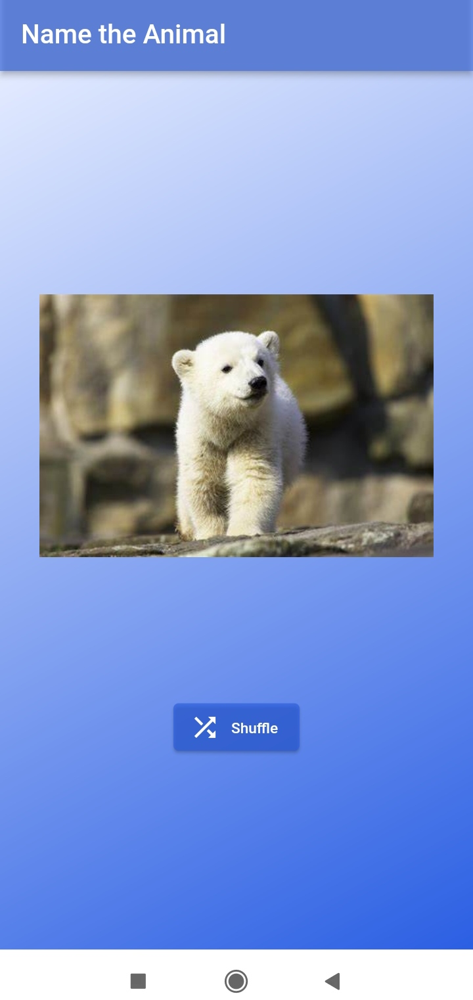
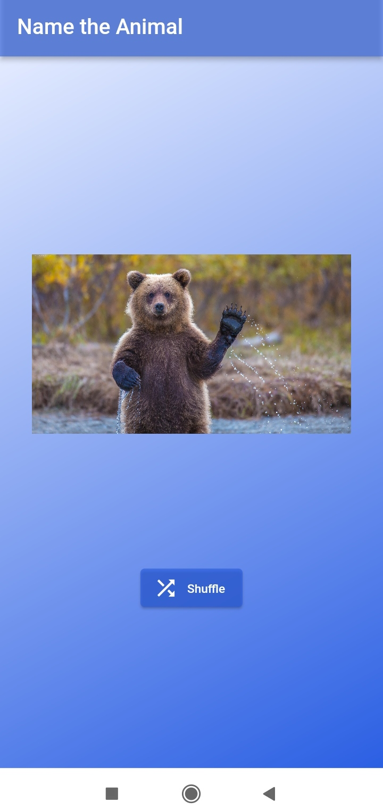

# Animal Image Guessing Flutter App

A fun guessing game where users try to guess the animal based on shuffled images.

## Features

- Displays an image of an animal.
- A "Shuffle" button to shuffle the image of the animal.
- Random animal images for varied gameplay.

## Screenshots

<p >
  
  
</p>


## Getting Started

### Prerequisites

- Flutter SDK: [Install Flutter](https://flutter.dev/docs/get-started/install)
- Dart SDK (included with Flutter)

### Installation

1. Clone the repository:
    ```sh
    git clone https://github.com/aparnaprabhuu/Shuffled-animal-app.git
    ```
2. Navigate to the project directory:
    ```sh
    cd Shuffled-animal-app
    ```
3. Install dependencies:
    ```sh
    flutter pub get
    ```

### Running the App

1. Ensure a device is connected or an emulator is running.
2. Run the app:
    ```sh
    flutter run
    ```
